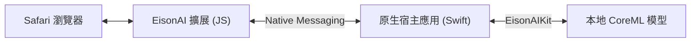

# EisonAI

EisonAI 是一個注重隱私的 Safari 瀏覽器擴展，利用本地運行的先進大語言模型（Local LLM）技術，為您提供快速、精確的網頁內容總結。所有數據處理均在您的設備上完成，無需將網頁內容發送至第三方伺服器，確保您的隱私安全。

## 核心特點

- **本地智能 (Local Intelligence)**：
  - 內建支援 CoreML 的本地大語言模型（基於 Qwen3-0.6B）。
  - 無需依賴 OpenAI 或 Gemini 等外部 API，無需連網即可生成摘要（模型下載完成後）。
  - 充分利用 Apple Silicon 的強大效能，實現快速推理。

- **隱私優先 (Privacy First)**：
  - 您的瀏覽記錄和網頁內容永遠不會離開您的設備。
  - 真正的離線可用，數據完全掌握在您手中。

- **智能內容提取**：
  - 使用 Readability 技術自動識別網頁正文，過濾廣告與無關元素。
  - 支援長文章處理，透過分塊傳輸技術（Chunked Native Messaging）處理大量內容。

- **優雅的使用體驗**：
  - 一鍵生成摘要，自動提取標題與重點。
  - 簡潔的結構化輸出：總結 + Emoji 條列式要點。
  - 響應式設計，完美適配 macOS 與 iOS Safari。

## 系統要求

由於使用了最新的 CoreML 本地模型技術，EisonAI 需要較新的系統版本：

- **iOS 18.0** 或更高版本
- **macOS 15.0 (Sequoia)** 或更高版本
- **Safari 18.0** 或更高版本
- 建議使用搭載 Apple Silicon (M系列/A系列) 晶片的設備以獲得最佳效能。

## 安裝與使用

1. **安裝應用程式**：
   - 下載並安裝 EisonAI App (iOS/macOS)。
   - 首次啟動 App 時，請保持網路連線以自動下載本地模型文件 (Qwen3-0.6B)。

2. **啟用擴展**：
   - **macOS**: 開啟 Safari -> 設定 -> 擴展 -> 勾選 EisonAI。
   - **iOS**: 開啟 Safari -> 網址列 "大小" 圖標 -> 管理擴展 -> 開啟 EisonAI。

3. **開始使用**：
   - 在任意文章頁面，點擊 Safari 工具列中的 EisonAI 圖標。
   - 點擊 "AI Summary"。
   - 擴展將自動提取內容並呼叫本地模型生成摘要。

## 系統架構

EisonAI 採用了安全的 Native Messaging 架構來連接瀏覽器與本地模型：



1. **Content Script**: 負責提取網頁正文。
2. **Background Script**: 協調通訊，透過 Native Messaging 將數據傳遞給宿主應用。
3. **Native Host App**: 接收請求，使用 `AnyLanguageModel` 加載 CoreML 模型進行推理，並將結果回傳。

## 開發指南

### 環境設置

1. 克隆倉庫：
```bash
git clone https://github.com/yourusername/eisonAI.git
cd eisonAI
```

2. 初始化子模組 (AnyLanguageModel)：
   本項目依賴 `AnyLanguageModel` 進行模型推理，請確保同級目錄下有該項目或透過 Swift Package Manager 配置。

3. 開啟 Xcode 項目：
```bash
open eisonAI.xcodeproj
```

### 關鍵技術

- **Swift 6.1**: 宿主應用與擴展處理程序。
- **CoreML**: 本地模型推理加速。
- **AnyLanguageModel**: LLM 推理框架。
- **Native Messaging**: 瀏覽器與原生應用之間的安全通訊橋樑。

## 許可證

本項目基於 MIT 許可證開源 - 查看 [LICENSE](LICENSE) 文件了解更多信息。

## 致謝

- **Qwen**: 強大的開源語言模型。
- **Readability.js**: 優秀的網頁內容提取庫。
- **AnyLanguageModel**: 便捷的 Swift LLM 封裝庫。